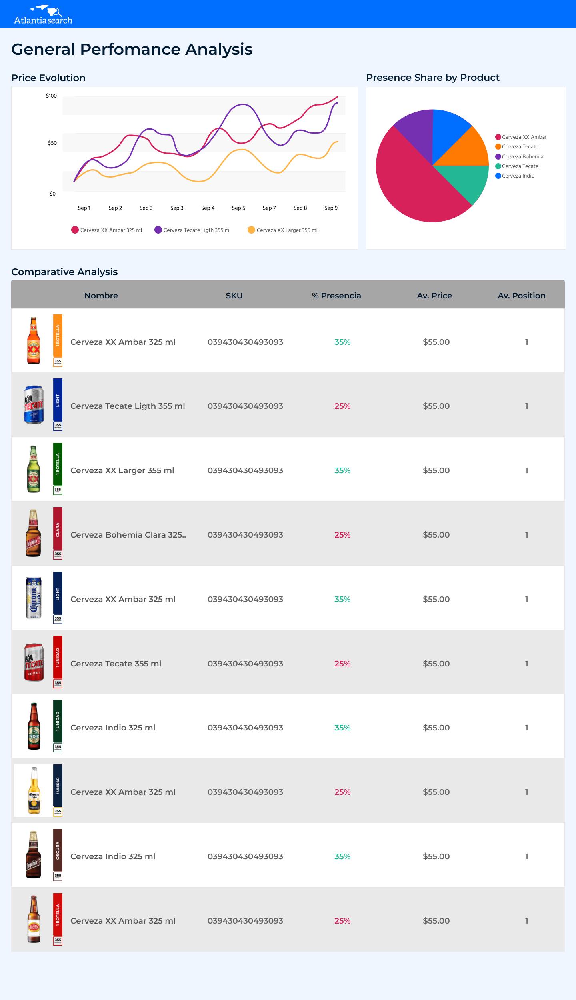

# Project description

The objective of this project is only to present the Frontend test of the [Atlantia search](https://atlantiasearch.com/es-MX) company.

## Tech stack

- React 17
- CSS
- Apex charts 3.33.0
- React testing library 12.1.2
- Node 14.16.0
- Npm 6.14.11

## Main objectives

- Usability
- Performance
- Scalability
- Transform a figma mockup to react app

## Available Scripts

In the project directory, you can run:

### `npm start`

Runs the app in the development mode.\
Open [http://localhost:3000](http://localhost:3000) to view it in your browser.

The page will reload when you make changes.\
You may also see any lint errors in the console.

### `npm test`

Launches the test runner in the interactive watch mode.\

### `npm run build`

Builds the app for production to the `build` folder.\
It correctly bundles React in production mode and optimizes the build for the best performance.

The build is minified and the filenames include the hashes.\
Your app is ready to be deployed!
